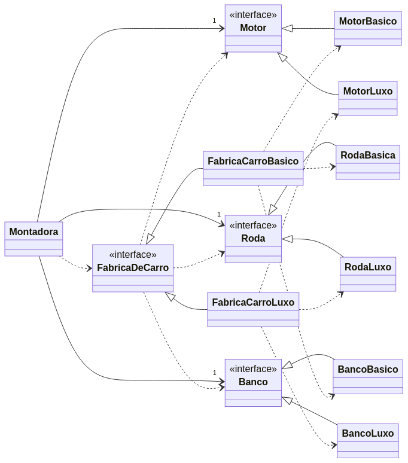

# Implementação do Padrão de Projeto: Abstract Factory

O **Abstract Factory** é um padrão projeto criacional que fornece uma interface para criar **famílias de objetos** relacionados ou dependentes sem especificar suas classes concretas. Ele permite que um sistema seja configurado com uma família de produtos, e que essa família possa ser trocada por outra sem ser alterar o código cliente que a utilizada.

Os componentes principais do padrão são:
- **AbstractFactory (Fábrica Abstrata):** Declara uma interface para operações que criam produtos abstratos.
- **ConcreteFactory (Fábrica Concreta):** Implementa as operações de criação de produtos para produzir objetos de uma família específica.
- **AbstractProduct (Produto Abstrato):** Declara uma interface para um tipo de objeto produto.
- **ConcreteProduct (Produto Concreto):** Define um objeto produto a ser criado pela fábrica concreta correspondente e implementa a interface AbstractProduct.
- **Client (Cliente):** Utiliza as interfaces AbstractFactory e AbstractProduct.


## Cenário Aplicado: Montadora de Carro

Para esta implementação, foi escolhido o cenário de um **sistema de montadora de carro**. A ideia é que diferentes tipos de carros (básico e de luxo) sejam montados utilizando conjuntos de peças (motor, roda, banco) que são consistentes para cada tipo de carro. O padrão Abstract Factory é ideal para este cenário, pois permite a criação de famílias de produtos (peças de carro) sem que o cliente (a montadora) precise conhecer as classes concretas dessas peças. Isso garante que um carro básico sempre receba peças básicas e um carro de luxo sempre receba peças de luxo, mantendo a integridade da família de produtos.

A estrutura ficou definida da seguinte forma:
- AbstractFactory: FabricaDeCarro (interface para criar Motor, Roda e Banco)
- ConcreteFactory:
    - FabricaCarroBasico 
    - FabricaCarroLuxo
- AbstractProduct:
    - Motor 
    - Roda 
    - Banco
- ConcreteCreator:
    - MotorBasico, MotorLuxo
    - RodaBasica, RodaLuxo
    - BancoBasico, BancoLuxo
- Client: Montadora (utiliza uma FabricaDeCarro para montar um carro)

### Estrutura do Projeto
O projeto foi organizado utilizando a estrutura padrão do Maven.

```
├──pom.xml
└──src/
    ├── main/java/padroescriacao/abstractfactory/
    │   ├── FabricaDeCarro.java        # AbstractFactory (Interface)
    │   ├── FabricaCarroBasico.java    # ConcreteFactory
    │   ├── FabricaCarroLuxo.java      # ConcreteFactory
    │   ├── Motor.java                 # AbstractProduct (Interface)
    │   ├── Roda.java                  # AbstractProduct (Interface)
    │   ├── Banco.java                 # AbstractProduct (Interface)
    │   ├── MotorBasico.java           # ConcreteProduct
    │   ├── MotorLuxo.java             # ConcreteProduct
    │   ├── RodaBasica.java            # ConcreteProduct
    │   ├── RodaLuxo.java              # ConcreteProduct
    │   ├── BancoBasico.java           # ConcreteProduct
    │   ├── BancoLuxo.java             # ConcreteProduct
    │   └── Montadora.java             # Client
    └── test/java/padroescriacao/abstractfactory/
        └── MontadoraTest.java
```

### Diagrama


### Tecnologias Utilizadas
- Java 11: Linguagem de programação principal.
- Maven 3.8+: Ferramenta de automação de build e gerenciamento de dependências.
- JUnit 5: Framework para a escrita e execução de testes unitários.